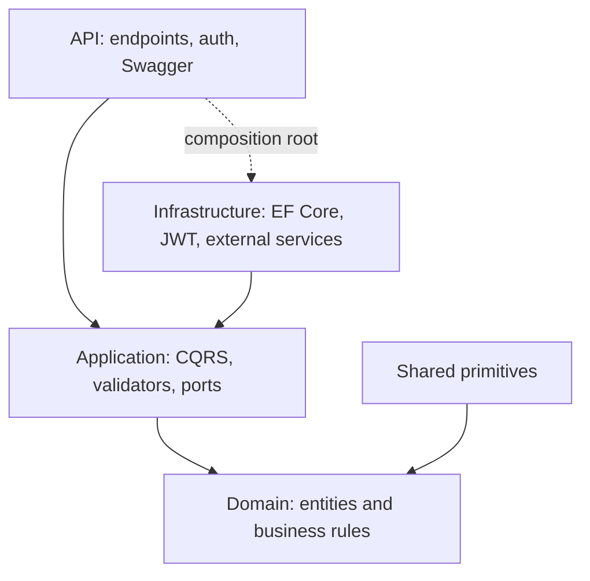

# Clean Architecture Boilerplate


A .NET enterprise API template with Clean Architecture, CQRS, validation, EF Core, JWT authentication, role-based authorization, Swagger, Docker and CI.

The sample domain is intentionally small: delivery projects and project tasks. It gives the architecture enough behavior to be meaningful without turning the repository into a product-specific application.

## Dependency Rule



## Highlights

- ASP.NET Core API on .NET 10
- Clean Architecture layer separation
- CQRS request handlers with MediatR
- FluentValidation pipeline behavior
- EF Core with PostgreSQL
- JWT authentication and RBAC
- Auditable entities with current-user context
- Problem Details exception handling
- Swagger/OpenAPI with bearer authentication
- Docker Compose local stack
- GitHub Actions CI
- Unit tests for Domain, Application and Infrastructure behavior

## What This Demonstrates

- Enterprise-ready project template with clear layer boundaries.
- CQRS handlers, validation pipeline and auditable domain model.
- Authenticated API surface with role-based authorization and Swagger.
- Practical template structure that can be reused without exposing client work.

## Structure

```text
src/
  CleanArchitecture.Api             HTTP, auth, Swagger, exception handling
  CleanArchitecture.Application     Use cases, validators, abstractions
  CleanArchitecture.Domain          Entities, enums, business rules
  CleanArchitecture.Infrastructure  EF Core, JWT, external services
  CleanArchitecture.Shared          Cross-layer primitives
tests/
  CleanArchitecture.Tests
```

Architecture details are in [docs/architecture.md](docs/architecture.md).

## Run Locally

### Prerequisites

- .NET 10 SDK
- Docker and Docker Compose

```bash
docker compose up --build
```

Services:

- API: `http://localhost:8080`
- Swagger: `http://localhost:8080/swagger`
- PostgreSQL: `localhost:5432`

Demo credentials:

```text
architect / ChangeMe123!
```

## API Flow

1. Create a token:

```http
POST /api/v1/auth/token
Content-Type: application/json

{
  "username": "architect",
  "password": "ChangeMe123!"
}
```

2. Create a project:

```http
POST /api/v1/projects
Authorization: Bearer <token>
Content-Type: application/json

{
  "name": "ERP Modernization Platform",
  "key": "ERP2026",
  "description": "Reference project used to demonstrate clean application boundaries."
}
```

3. Add a task:

```http
POST /api/v1/projects/{projectId}/tasks
Authorization: Bearer <token>
Content-Type: application/json

{
  "title": "Define integration boundary",
  "description": "Document ownership between API, application and infrastructure layers.",
  "dueDate": "2026-07-15",
  "priority": "High"
}
```

## Validate

```bash
dotnet restore CleanArchitectureBoilerplate.slnx
dotnet format CleanArchitectureBoilerplate.slnx --verify-no-changes
dotnet build CleanArchitectureBoilerplate.slnx --configuration Release
dotnet test CleanArchitectureBoilerplate.slnx --configuration Release --no-build
```

## Security Notes

The included database credentials, demo user and JWT signing key are local development defaults. Replace them with environment variables or a secret manager before adapting this template to any real environment.
