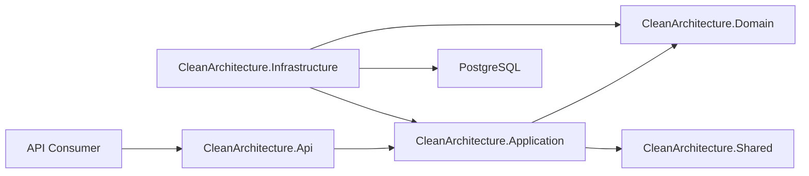

# Architecture

This boilerplate is a production-oriented starting point for enterprise APIs.

## Dependency Rule

- `Domain` has no dependency on other layers.
- `Application` depends on `Domain` and `Shared`.
- `Infrastructure` implements Application abstractions.
- `Api` composes the application and exposes HTTP endpoints.

## Included Patterns

- CQRS with MediatR request handlers
- FluentValidation pipeline behavior
- EF Core DbContext behind an application abstraction
- JWT authentication and role-based authorization
- Auditable entities with current-user context
- Centralized exception handling with Problem Details
- Docker Compose for local Postgres
